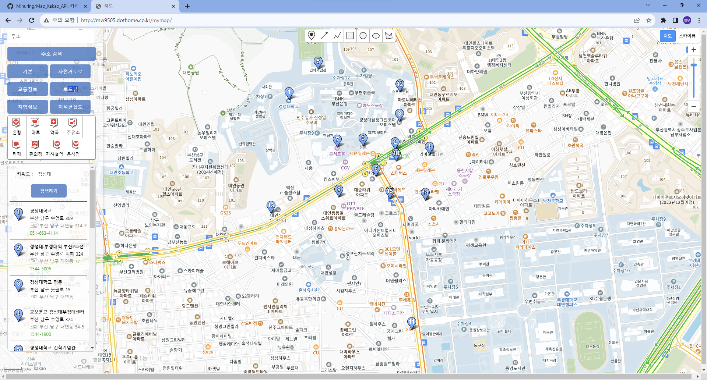

# Map (KakaoAPI)

카카오 API를 활용 및 수정해 만든 지도 사이트입니다.
[Kakao 지도 API](https://apis.map.kakao.com/)를 참고하여 제작했습니다.

- 다음 우편번호 API

- 카카오 맵 API
    - 추가한 라이브러리 :
        - 지도타입(교통정보, 자전거도로, 지형정보 등) 라이브러리
        - 툴박스(지도 상단의 마커, 도형, 선 그리기) 라이브러리
        - 지도타입(교통정보, 자전거도로, 지형정보 등) 라이브러리
        - 키워드검색 라이브러리
        - 카테고리검색 라이브러리

12.07 todo - 해결됨

index.html에서 script태그 너무 여기저기 흩어져있음
script 폴더로 묶기, css 파일 분리하고 폴더로 묶기
: 폴더 정리 후 경로 재설정

카테고리 검색이 키워드검색보다 무조건 우선으로나옴
: 동시에 나오게 각 검색 옵션별로 다른 마커를 사용하여 해결

&plus; 지도가 처음 로딩될 때 경성대학교를 중심좌표로 설정